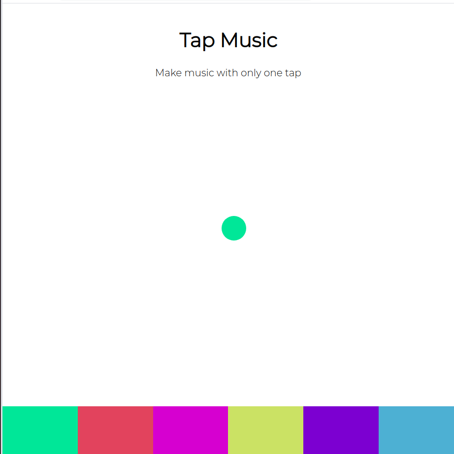

# Beat-maker
A simple beat maker in pure Vanilla Javascript 

## A Glimpse


## Installation
To run this app follow these commands on terminal :
```
git clone https://github.com/kuruma99/Beat-maker.git
cd Beat-maker
google-chrome index.html
```

## Highlights
- [x] Vanilla JS
- [x] Well documented
- [x] Usage of keyframes to look it visually appealing

## To add your own sound
* Save your mp3 sound in the./sounds folder
* Add the path of your file in the 'audio' of pads
